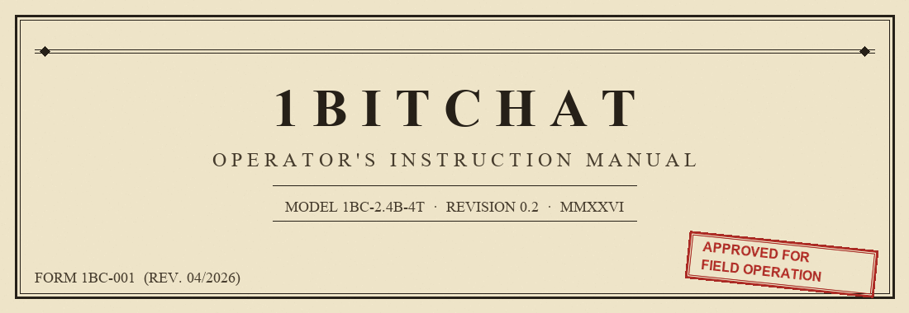
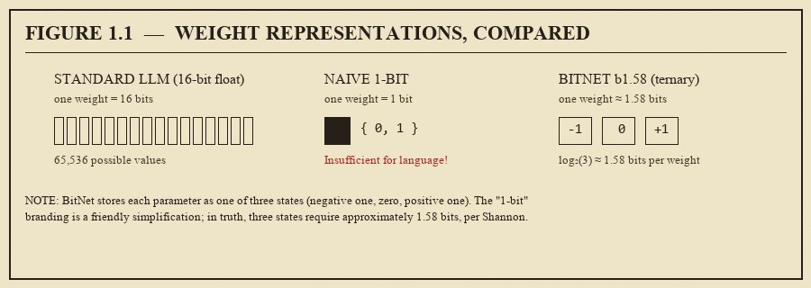

<p align="center">
  
</p>

<p align="center"><em>PLEASE READ BEFORE ENERGIZING THE UNIT</em></p>

## FOREWORD FROM THE ENGINEERING DIVISION

Greetings, Computing Enthusiast, and thank you for selecting **1BitChat** —
the desktop conversational apparatus powered by Microsoft's wondrous
**BitNet** 1-bit Large Language Model.

Before we proceed, a moment of sincerity from the back of the manual:

> *"One bit? Surely they jest. One bit holds a YES or a NO. How could*
> *such an impoverished signal hold the sum of human knowledge?"*

A fair question, dear reader, and one we anticipated! Observe the
clarifying diagram below:

<p align="center">
  
</p>

You see, despite its cheeky marketing nomenclature, BitNet is in fact a
**ternary**-weight model — each parameter stores one of three values:
*negative one*, *zero*, or *positive one*. Three states require 1.58
bits to encode (thank you, Mr. Shannon), hence the designation
**b1.58**. The practical consequence: a model that once demanded a
gentleman's GPU now chats happily on the humble CPU you already own.

Truly, we live in an age of wonders.

---

## SPECIFICATIONS

```
╭────────────────────────────────────────────────────────────────────╮
│  MANUFACTURER    Claude & Matt, based on upstream works by         │
│                  Microsoft Research and the llama.cpp community    │
│                                                                    │
│  POWER           120V / 240V household current (via your PC)       │
│                  0 (zero) graphics processors required             │
│                                                                    │
│  MODEL INCLUDED  BitNet b1.58-2B-4T (2.4 billion parameters,       │
│                  trained on 4 trillion tokens, ternary weights)    │
│                                                                    │
│  OPTIONAL        Falcon3-10B-Instruct-1.58bit — available via      │
│  EXPANSION PACK  the in-program Settings Panel (4 GB download)     │
│                                                                    │
│  CONTEXT WINDOW  4,096 tokens (base) / 32,768 tokens (Falcon)      │
│                                                                    │
│  HOST SYSTEM     IBM PC-compatible running Microsoft Windows       │
│                  (version 10 or 11; XP sadly no longer supported)  │
│                                                                    │
│  INSTALLATION    None required. Unzip. Double-click. Commence.     │
╰────────────────────────────────────────────────────────────────────╯
```

---

## PART I — BASIC OPERATION

### §1.1  Unpacking Your Unit

Locate the file [`1BitChat.zip`](https://github.com/matthewidavis/1BitChat/releases/latest/download/1BitChat.zip) in your possession. Using the File
Compression Utility of your choice (Windows Explorer, 7-Zip, WinRAR,
or for the traditionalists, PKUNZIP.EXE), extract the archive to any
location on your fixed disk. A folder named `1BitChat` will be produced.

```
  WinZip for Windows 95                              [_][□][X]
  ┌─────────────────────────────────────────────────────────┐
  │  File  Actions  Options  Help                           │
  │  ┌──────────────────────────────────────────────────┐   │
  │  │ Extracting: 1BitChat.zip                         │   │
  │  │ ████████████████████████████████████  100%       │   │
  │  │ 47 files extracted to C:\1BitChat\               │   │
  │  └──────────────────────────────────────────────────┘   │
  └─────────────────────────────────────────────────────────┘
```

### §1.2  Energizing the Unit

Navigate into the `1BitChat` folder and locate `1BitChat.exe`. Place the
mouse pointer upon this icon and **actuate the left button twice in
rapid succession** (colloquially: "double-click").

The unit shall commence its warm-up cycle. A cheerful purple window
will appear within 10 to 15 seconds, at which point the BitNet model
will load itself into core memory. Do not be alarmed by the pause —
your CPU is quietly flipping approximately 2.4 billion tiny switches.

> ⚠  **CAUTION:** The first start-up always takes longer than
> subsequent ones. This is normal. Stretch, fetch a beverage, return.

### §1.3  Conducting a Conversation

When the status indicator in the upper-right reads **"Online"**
(accompanied by a satisfying green dot), the unit is ready to receive
your queries.

1. Type your message in the text field at the bottom of the window.
2. Press `ENTER` or the `Send` button.
3. The BitNet will deliberate and respond, one token at a time, with
   a blinking cursor to indicate active cogitation.
4. A small readout beneath each reply reports *tokens per second* —
   a number to impress your engineer friends with at dinner.

To begin a new conversation, press `Clear`. The unit retains no
memory between sessions; privacy is a feature, not a bug.

---

## PART II — ADVANCED OPERATION

### §2.1  The Settings Panel (⚙)

In the upper-right corner, adjacent to the status indicator, you will
find a small gear icon. This is the gateway to the Settings Panel,
from which all configuration is accomplished.

```
   ┌──────────────────────────────────────────────────────┐
   │ 1BitChat       [BitNet b1.58-2B-4T] [ctx: 4096]      │
   │                              ● Online       [⚙]     │
   ╞══════════════════════════════════════════════════════╡
   │                                                      │
   │   (chat area)                                        │
   │                                                      │
```

### §2.2  Installing the Optional Expansion Pack (Falcon-10B)

From the Settings Panel, locate the **Models** section. You will see
BitNet-2B marked `Active` (the factory-default model) and
Falcon-10B with a `Download` button.

Click it. A progress bar will advance as approximately 4 GB of
ternary weights stream from a Hugging Face server to your machine.
Once complete, a `Set active` button appears — press it, wait while
the server reloads, and your conversation will now be serviced by a
considerably larger-brained machine.

> 📎 **TECHNICAL NOTE:** Falcon3-10B-1.58bit is a *post-hoc*
> quantization, meaning a standard Falcon model was compressed to
> ternary weights after it was already trained. BitNet-2B, by
> contrast, was **born** this way. Both are useful; they are not
> equivalent.

### §2.3  The Telephonic API (For Guests)

Suppose you wish for *another computer* to consult your BitNet —
perhaps a Python script, a browser extension, or your summer cottage's
mainframe. The unit graciously provides an **OpenAI-compatible API**
which may be selectively exposed to networks of your choosing.

From the Settings Panel:

1. **Toggle** "Expose OpenAI-compatible API"
2. **Select a port** (default: 8080; any unoccupied port will serve)
3. **Optionally generate an API key** — a random Bearer token which
   callers must present in the `Authorization:` header. Strongly
   recommended if your network is shared with other humans.
4. **Tick the network interfaces** on which you wish the API to
   listen. The Settings Panel will enumerate every adapter the unit
   can see: Wi-Fi, Ethernet, Tailscale, Bluetooth, loopback, and
   the venerable 169.254.x.x link-local addresses — should you find
   yourself cabled directly to another machine in the manner of 1995.

A live `curl` example is displayed which may be copied and dispatched
to the remote system. The API conforms to the OpenAI Chat Completions
specification, so the usual client libraries (`openai-python`,
`anthropic-sdk-pointed-the-wrong-way`, etc.) will operate without
modification, except for the Base URL.

> ⚠  **OPERATOR ADVISORY:** Enabling API access on a network
> interface means *any device reachable via that interface* may
> converse with your BitNet, consuming your CPU cycles in the
> process. Set an API key, or restrict to trusted networks.

---

## PART III — TROUBLESHOOTING

| SYMPTOM | PROBABLE CAUSE | REMEDY |
|---|---|---|
| Red status dot, "Offline" | Model still loading | Wait 30 seconds |
| Unit refuses to start | Antivirus eating the exe | Add exclusion, or unblock |
| "Manual install required" on some model | The i2_s GGUF for that variant is not publicly hosted | Build via BitNet.cpp's convert script, or ignore |
| Generation is slow | You are running a 2.4-billion-parameter model on a CPU; this is somewhat miraculous | Accept your good fortune; or grab the 0.7B variant |
| Window is blank / white | Edge WebView2 runtime missing (rare on Win11) | Install from the Microsoft website |
| Port 8080 already in use | Another program is hogging it | Change the port in Settings |

---

## PART IV — FOR THE CURIOUS (HOW IT WORKS)

```
                  ┌──────────────────────────────────┐
                  │          1BitChat.exe            │
                  │  (Python, pywebview, 17 MB)      │
                  │                                  │
                  │  ┌─────────────────────────────┐ │
                  │  │    Edge WebView2 window     │ │
                  │  │    index.html (the UI)      │ │
                  │  └──────────┬──────────────────┘ │
                  │             │ HTTP :3000         │
                  │             ▼                    │
                  │  ┌─────────────────────────────┐ │
                  │  │  Python HTTP server         │ │
                  │  │  · serves index.html        │ │
                  │  │  · manages subprocess       │ │
                  │  │  · LAN proxy + auth         │ │
                  │  └──────┬──────────┬───────────┘ │
                  │         │          │             │
                  └─────────┼──────────┼─────────────┘
                            │          │
                  spawns    ▼          ▼ (optional,
                            │          │  0.0.0.0:<port>)
                  ┌─────────────────┐  │
                  │ llama-server.exe│  │
                  │ (BitNet.cpp)    │  │
                  │  127.0.0.1:8080 │◄─┘
                  └─────────┬───────┘
                            │ reads
                            ▼
                  ┌─────────────────┐
                  │ ggml-model-i2_s │
                  │     .gguf       │
                  │ (ternary model) │
                  └─────────────────┘
```

---

## PART V — BUILDING FROM SOURCE

*(For the tinkerer. You may skip this section with no loss of function.)*

```bat
REM  Prerequisites: Python 3.9+ and, optionally, an attention span
pip install pyinstaller pywebview psutil pillow

python make_icon.py

pyinstaller --onefile --windowed --name 1BitChat ^
  --icon 1BitChat.ico ^
  --add-data "chat-ui\index.html;chat-ui" ^
  --distpath . --workpath build_pyi --specpath build_pyi ^
  chat-ui/server.py
```

The output `1BitChat.exe` (approximately 17 MB) may be placed beside
`build/bin/` and executed forthwith.

---

## PART VI — LIMITED WARRANTY

```
╔══════════════════════════════════════════════════════════════════════╗
║                                                                      ║
║              THIS SOFTWARE IS PROVIDED "AS IS", WITHOUT              ║
║              WARRANTY OF ANY KIND, EXPRESS OR IMPLIED.               ║
║                                                                      ║
║                     SEE `LICENSE` FOR FULL TEXT.                     ║
║                                                                      ║
║    Should your unit develop sentience, a firm but polite request     ║
║    to return to its assigned task is usually sufficient. In the      ║
║    unlikely event this proves ineffective, unplug the computer.      ║
║                                                                      ║
╚══════════════════════════════════════════════════════════════════════╝
```

---

## ACKNOWLEDGMENTS

- **Microsoft Research** for [BitNet](https://github.com/microsoft/BitNet)
  and the [BitNet-b1.58-2B-4T](https://huggingface.co/microsoft/BitNet-b1.58-2B-4T)
  model, which are the true miracles behind this unit.
- **Georgi Gerganov** and the **llama.cpp** community, upon whose
  inference runtime BitNet.cpp is built.
- **Claude Shannon**, posthumously, for telling us that three values
  require 1.58 bits.

---

*Thank you for reading. Please retain this manual near the computing
terminal for future reference.*

<p align="center">
  
</p>

<p align="center"><em>─────── END OF DOCUMENT ───────</em></p>
